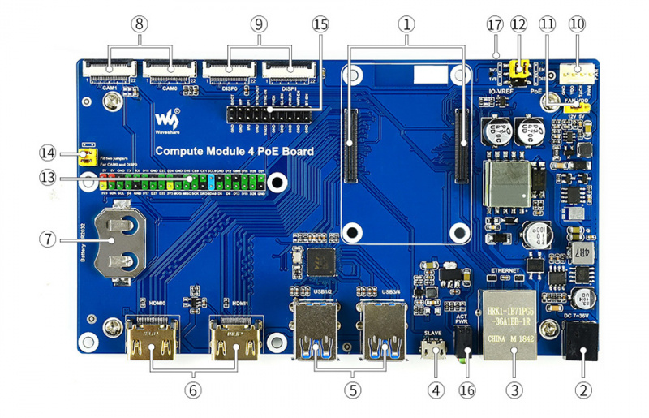

# waveshare-fan
本项目是为树莓派 cm4 waveshare 底板编写的控制程序。  



微雪的这个底板提供了一个可调速风扇的接口，然后我就想着写一个温控调速程序，官方也提供了 API，写起来挺简单。既然都写了风扇调速了，我就想着再搞一个 oled，用来开机后显示各种信息。这里我弄的 128x64 IIC oled, 可以显示 CPU 使用率、温度、风扇转速等级（根据温度来计算的，0-255）、风扇实际转速、内存使用情况、磁盘使用情况和 IP。  
不过配套的这个微雪金属外壳是全密封的，GPIO 接口也封在了里面，然后我就试着用 GPIO T形扩展板引出来，虽然合外壳的时候要费点力，不过这个缝隙还是可以。  

Copyright (C) 2022 IYATT-yx iyatt@iyatt.com

## 测试环境
树莓派 cm4 + 微雪扩展板 - 官方 64 位桌面系统 2022.1 版（Debian 11）  

## 使用
oled 需要使用 IIC，所以需要在树莓派设置打开 IIC


另外需要以 root 权限编辑 /boot/config.txt  
追加一行 `dtparam=i2c_vc=on` 以设置风扇 IIC 开机自动挂载

安装基本构建工具  
```bash
sudo apt update
sudo apt install build-essential git cmake
```

获取源码  
```bash
git clone https://github.com/IYATT-yx/waveshare-fan.git --depth=1
cd waveshare-fan
```

安装 [WiringPi](https://github.com/WiringPi/WiringPi) 库
```bash
cd WiringPi
./build
```

安装 [IIC oled](https://github.com/IYATT-yx/ssd1306_i2c) 库  
```bash
cd ../ssd1306_i2c
mkdir -p build_dir && cd build_dir
cmake -DCMAKE_BUILD_TYPE=release ..
sudo make install
sudo -s
echo "export PKG_CONFIG_PATH=$PKG_CONFIG_PATH:/usr/local/lib/pkgconfig" >> /etc/bash.bashrc
source /etc/bash.bashrc
exit
```

安装控制程序
```
cd ../../
mkdir -p build_dir && cd build_dir
cmake -DCMAKE_BUILD_TYPE=release ..
make install
```

设置自启动:  
以 root 权限编辑 /etc/rc.local，在 exit 0 前面的行添加
```bash
/home/pi/.waveshare-fan/waveshare-fan
```
